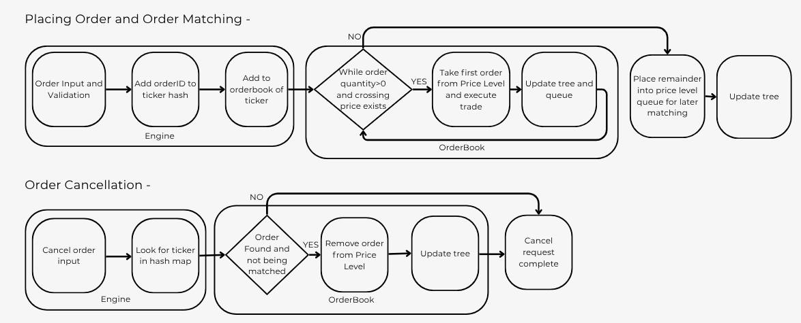

# Order Book Simulator

A high-performance order book matching engine implementation in C++, designed to efficiently process and match buy/sell orders across multiple stock tickers.

## Overview

This project implements a complete trading order book system with the following features:

- **Multi-ticker order books**: Maintains separate order books for each stock ticker
- **Buy/Sell order matching**: Implements price-time priority matching algorithm
- **Order cancellation**: Supports cancelling orders by order ID
- **High-performance data structures**: Uses AVL trees and object pools for efficient memory management
- **Performance metrics**: Tracks timing statistics for order insertion, matching, and cancellation

## Project Structure

```
orderbook-simulator/
├── core_code/
│   ├── engine.h/cpp         
│   ├── orderbook.h/cpp       
│   ├── order.h               
│   └── pricelevel.h          
├── data_structures/
│   ├── avltree.h             
│   └── vector_object_pool.h  
├── data_handling/
│   ├── types.h               
│   ├── constants.h           
│   └── logger.h              
├── main.cpp                  
├── data.csv                  
└── README.md                 
```

## Input Format

The program accepts a CSV file with the following format:

```csv
BUY,<TICKER>,<PRICE>,<QUANTITY>
SELL,<TICKER>,<PRICE>,<QUANTITY>
CANCEL,<TICKER>,<ORDER_ID>,
```

### Example:
```csv
BUY,DIS,119.88,1814
SELL,PYPL,261.01,217
CANCEL,JPM,10,
```

**Fields:**
- **Command**: `BUY`, `SELL`, or `CANCEL`
- **Ticker**: Stock symbol (e.g., AAPL, GOOGL, MSFT)
- **Price**: Order price (for BUY/SELL only)
- **Quantity**: Number of shares (for BUY/SELL only)
- **Order ID**: Order identifier (for CANCEL only)

## System Overview and Logic Flow




## Building the Project

### Prerequisites
- C++17 compatible compiler (GCC 7+, Clang 5+, or MSVC 2017+)
- Standard C++ library

### Compilation

Compile with the following command:

```bash
g++ main.cpp core_code/engine.cpp core_code/orderbook.cpp \
    -Icore_code -Idata_handling -Idata_structures \
    -std=c++17 -O3 -march=native -o orderbook.exe
```
## Running the Simulator

Execute the compiled binary with a CSV input file:

```bash
./orderbook.exe data.csv
```

The program will:
1. Read trading orders from the CSV file
2. Process each order (BUY/SELL/CANCEL) sequentially
3. Execute the matching algorithm after each operation
4. Display performance statistics at the end

### Output

The program tracks and displays:
- Total insertion time (microseconds)
- Total matching time (microseconds)
- Total cancellation time (microseconds)
- Number of insertions and cancellations processed

## Notes
- Results in terms of latency might differ in different Operation Systems due to the presence of different allocators and system timers.  

## License
MIT